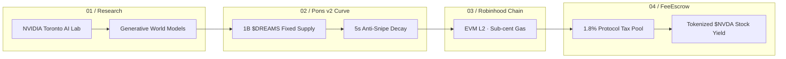

# NVIDIA OmniDreams ($DREAMS) Protocol

<p align="center">
  
</p>

<p align="center">
  <strong>Generative World Models. Onchain Spatial Compute.</strong><br>
  <em>Bridging NVIDIA Research spatial simulation architectures directly to Robinhood Chain (EVM L2).</em>
</p>

<p align="center">
  <a href="https://omnidreams.xyz"></a>
  <a href="https://x.com/Gemesis_Group"></a>
  <a href="https://ponsfamily.com/launchpad/create"></a>
  
  
</p>

---

## 1. Overview

**NVIDIA OmniDreams ($DREAMS)** is a decentralized token protocol inspired by foundational generative world model research from **NVIDIA Research / Toronto AI Lab**. It pioneers the stock dividend narrative on **Robinhood Chain (EVM L2 · Chain ID: 92001)**, pairing generative spatial compute narratives natively with tokenized **$NVDA** stock distributions.

### Core Technical Pillars:
- **100% Fair Launch:** 1,000,000,000 fixed supply minted directly into the Pons v2 bonding curve. Zero team pre-allocation.
- **Anti-Snipe Protection:** 99% penalty decay over 5 blocks / seconds post-deployment to guarantee fair organic distribution.
- **Automated $NVDA Dividends:** 1.8% (180 BPS) fee collected on secondary volume via Pons `FeeEscrow` and routed directly into tokenized NVIDIA stock ($NVDA) shares.
- **Permanent Liquidity Graduation:** 100% reserve liquidity migrated and burned on Uniswap v4 via `LaunchLocker` at $68,000 market cap threshold.

---

## 2. Architecture & Data Flow



---

## 3. Verifiable Onchain Parameters

| Parameter | Value | Verification |
| :--- | :--- | :--- |
| **Token Name** | `NVIDIA OmniDreams` | ERC-20 Standard (Fixed Supply) |
| **Token Symbol** | `$DREAMS` | Trading Ticker |
| **Network** | Robinhood Chain (HOOD) | EVM L2 (Chain ID: `92001`) |
| **Quote Asset** | `NVDA` | Tokenized NVIDIA Stock |
| **Total Supply** | `1,000,000,000 DREAMS` | Fixed, No Mint, No Blacklist |
| **Creator Tax Rate** | `1.8%` (180 BPS) | Automated via Pons FeeEscrow |
| **Starting Market Cap** | `$3,800` | Trench Curve Start |
| **Graduation Market Cap**| `$68,000` | Permanent LP Burn on Uniswap v4 |
| **Contract Address (CA)**| `SOON...` | Revealing on Pons v2 Launch |

---

## 4. Smart Contract Architecture

The repository is organized into modular Solidity contracts compatible with Foundry and Hardhat:

```text
contracts/
├── OmniDreamsToken.sol          # Immutable ERC-20 token implementation
├── FeeEscrowDistributor.sol     # 1.8% volume routing to tokenized $NVDA
└── interfaces/
    ├── IPonsBondingCurve.sol    # Pons v2 Launchpad interface
    └── ILaunchLocker.sol        # Uniswap v4 permanent lock interface
```

### Key Safety Invariants:
1. **No Mint Function:** Total supply capped permanently at 1,000,000,000 tokens.
2. **No Proxy / Upgradeability:** Logic is completely immutable upon deployment.
3. **No Blacklist or Pause:** Transfers cannot be selectively frozen by any key.

---

## 5. Development & Testing

### Prerequisites
- [Foundry](https://getfoundry.sh/) (Forge & Cast) or [Bun](https://bun.sh) / Node.js
- RPC Endpoint: `https://rpc.robinhood.com` (Chain ID: `92001`)

### Build
```bash
forge build
```

### Run Tests
```bash
forge test -vvv
```

---

## 6. Official Links & Community

- **Website & Terminal:** [https://omnidreams.xyz](https://omnidreams.xyz)
- **Twitter / X:** [https://x.com/Gemesis_Group](https://x.com/Gemesis_Group)
- **Launchpad:** [https://ponsfamily.com/launchpad/create](https://ponsfamily.com/launchpad/create)
- **NVIDIA Research:** [https://research.nvidia.com/research-area/generative-ai](https://research.nvidia.com/research-area/generative-ai)

---

## 7. License

Distributed under the MIT License. See `LICENSE` for more information.
