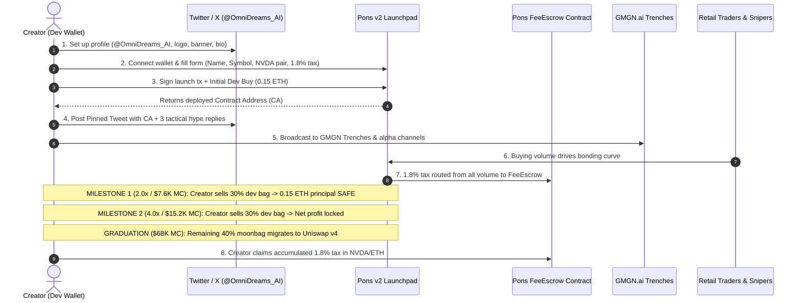

# Pons v2 Launchpad Execution Walkthrough: NVIDIA OmniDreams ($DREAMS)

This guide provides the complete, field-tested operational manual for launching **NVIDIA OmniDreams ($DREAMS)** on **Robinhood Chain (HOOD)** via **Pons Launchpad v2**.

---

## 1. Executive Summary & Parameters

| Parameter | Value | Reference / Notes |
| :--- | :--- | :--- |
| **Token Name** | `NVIDIA OmniDreams` | Full display name |
| **Token Symbol / Ticker** | `$DREAMS` | Trading ticker |
| **Network** | Robinhood Chain (HOOD) | EVM L2 (Chain ID: 92001) |
| **Launchpad** | Pons Launchpad v2 | `https://ponsfamily.com/launchpad/create` |
| **Pairing Quote Token** | `NVDA` | Tokenized NVIDIA Stock |
| **Creator Trading Tax** | `1.8%` (180 BPS) | Auto-deposited to Pons FeeEscrow |
| **Initial Dev Allocation Buy** | `0.15 ETH` (~$400–$500) | Bundled with launch or Block 0 snipe |
| **Initial Starting Cap** | ~$3,800 USD | Fair curve base valuation |
| **Graduation Cap** | ~$68,000 USD | Auto-migrates to Uniswap v4 pool |
| **Liquidity Lock** | Permanent (LaunchLocker) | 100% curve liquidity burned / locked |

---

## 2. Execution Flow Diagram



---

## 3. Pre-Flight Preparation (T-Minus 30 Minutes)

### Step 3.1: Wallet & Network Setup
1. Open **Rabby Wallet** or **MetaMask**.
2. Ensure you have network settings for **Robinhood Chain**:
   - **Network Name:** Robinhood Chain
   - **RPC URL:** `https://rpc.robinhood.com`
   - **Chain ID:** `92001`
   - **Currency Symbol:** `ETH`
   - **Block Explorer:** `https://explorer.robinhood.com`
3. **Wallet Balance:** Ensure the deployer wallet holds at least **0.20 – 0.25 ETH** (0.15 ETH for initial dev buy + 0.05 ETH for L2 gas and curve buffer).

### Step 3.2: Social Media Ready-State
1. Set up or rebrand Twitter account to `@OmniDreams_AI` (or `@OmniDreams_RH`).
2. Upload `launch_package/media/logo.png` as profile picture.
3. Upload `launch_package/media/banner.png` as header.
4. Set Display Name to: `NVIDIA OmniDreams ($DREAMS)`
5. Set Bio to:
   > `Real-time generative world model protocol inspired by @NVIDIA Research. Spatial simulation on Robinhood Chain ($HOOD). Earn tokenized $NVDA on volume.`
6. Set Website to: `https://research.nvidia.com/research-area/generative-ai`

---

## 4. Launch Execution on Pons v2 (T-0)

### Step 4.1: Access the Deployment Interface
1. Navigate to: **`https://ponsfamily.com/launchpad/create`**
2. Click **Connect Wallet** (top right) and confirm connection on Robinhood Chain.

### Step 4.2: Fill Token Creation Form
* **Token Name:** `NVIDIA OmniDreams`
* **Token Symbol:** `DREAMS`
* **Description:**
  ```text
  Real-time generative world model protocol powered by NVIDIA Research architecture. Bringing autonomous spatial simulation and AI closed-loop synthetic intelligence to Robinhood Chain ($HOOD), paired with tokenized NVDA.
  ```
* **Quote / Pairing Asset:** Select **`NVDA`** (Tokenized NVIDIA Stock on Robinhood Chain).
  * *Contingency Note:* If the UI prompts for standard ETH pairing or requires holding NVDA beforehand, select standard ETH pairing while keeping $NVDA as the primary reward/dividend narrative in marketing.
* **Creator Tax Rate:** Enter **`1.8%`** (180 basis points).
* **Website:** `https://research.nvidia.com/research-area/generative-ai`
* **Twitter / X:** `https://x.com/Gemesis_Group`
* **Telegram:** `https://t.me/OmniDreams_AI`
* **Token Icon / Logo:** Upload `launch_package/media/logo.png`.
* **Banner:** Upload `launch_package/media/banner.png`.

### Step 4.3: Initial Dev Buy
* In the **Initial Buy (Optional)** field on Pons v2:
  * Input: **`0.15 ETH`**
  * *Why:* Pons v2 automatically mints and exempts the deployer wallet from the 5-second 99% anti-snipe decay, securing ~5.5%–5.8% of the initial supply at the lowest possible price point ($3.8K MC).

### Step 4.4: Sign Deployment & Acquire CA
1. Click **Create Launch** (or **Deploy & Buy**).
2. Confirm the transaction in Rabby / MetaMask.
3. Once the transaction confirms on Robinhood Chain, copy the newly generated **Contract Address (CA)**.
4. Open the live token link: `https://www.ponsfamily.com/launchpad/{CA}`.

---

## 5. Post-Launch Hype Sequence (First 60 Seconds)

Speed is critical to capture early GMGN sniper bot attention and organic momentum.

### Action 1: Publish Pinned Tweet
1. Open `launch_package/social_pack/pinned_launch_tweet.txt`.
2. Replace `[INSERT_CA_HERE]` with your live CA.
3. Post the tweet immediately and click **Pin to profile**.

### Action 2: Execute Tactical Replies
1. Open `launch_package/social_pack/replies_thread.txt`.
2. Post under the latest tweets from `@nvidia`, `@vladtenev`, and `@PonsFamily` with your CA.

### Action 3: Trenches & Telegram Broadcast
1. Open `launch_package/social_pack/gmgn_shill_template.txt`.
2. Paste into GMGN Trenches discussion, Telegram alpha groups, and Discord trading channels.

---

## 6. Live Monitoring & Laddered Exit Execution

Launch the real-time monitor on your local terminal:
```bash
python scripts/monitor_bonding_curve.py --ca 0x[YOUR_TOKEN_CA]
```

### Laddered Exit Rules:

#### 1. Take Profit 1 (Target: 2.0x / $7,600 Market Cap)
* **Trigger:** Market Cap hits ~$7,600 (typically within 3–10 minutes of launch).
* **Action:** Go to your token page on Pons v2 and sell **30% of your dev tokens**.
* **Result:** Recovers **0.15 ETH** (100% of your initial capital). Your principal is now completely safe.

#### 2. Take Profit 2 (Target: 4.0x / $15,200 Market Cap)
* **Trigger:** Market Cap reaches ~$15,200.
* **Action:** Sell an additional **30% of your dev tokens**.
* **Result:** Locks in **+0.30 to +0.45 ETH** pure profit directly to your wallet.

#### 3. Moonbag Retained (40% of Dev Bag)
* **Rule:** Do NOT sell the remaining 40% on the bonding curve.
* **Graduation:** When bonding curve reaches 100% (~$68,000 MC), Pons v2 automatically migrates the curve liquidity into a Uniswap v4 pool and locks it forever via `LaunchLocker`.
* **Value:** Your 40% moonbag is now worth ~$1,500–$2,000+ USD on deep decentralized liquidity.

---

## 7. Claiming Creator Tax from Pons FeeEscrow

Throughout trading, 1.8% of all buy and sell volume is automatically routed to the Pons FeeEscrow contract.

1. Navigate to: **`https://ponsfamily.com/creator`** (or click your profile icon -> **Creator Earnings**).
2. Find **NVIDIA OmniDreams ($DREAMS)**.
3. View **Unclaimed Tax Balance** (accumulated in tokenized `NVDA` or `ETH`).
   - Expected at $30,000 volume: **$540.00 USD**
   - Expected at $50,000 volume: **$900.00 USD**
   - Expected at $100,000 volume: **$1,800.00 USD**
4. Click **Claim Fees** and sign the withdrawal transaction.

---

## 8. Safety & Contingency Protocols

* **High Network Congestion:** If Robinhood Chain gas spikes, increase priority fee in Rabby to 0.1 Gwei.
* **Slippage Settings:** If buying additional supply manually, set slippage to **3.0%** to account for the 1.8% creator tax plus bonding curve slope.
* **Contract Verification:** Pons v2 factory handles ERC-20 contract verification automatically on Robinhood Chain explorer.
